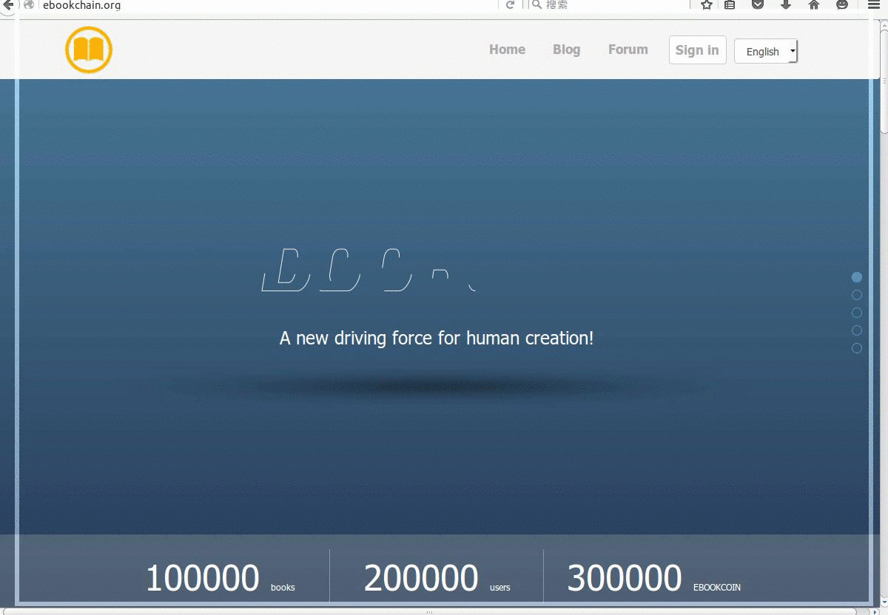

# Ebookchain 亿书

Ebookchain官方网站，可以作为产品类静态网站生成器使用，地址: http://ebookchain.org

## 特点

主要实现了以下几个功能（**这些功能，是目前很多网站都在用的**）：

* **导航动画**：网站的header根据垂直滚动条的位置，动态调整。这个我已经抽出来，做成了Ember的插件，源码地址：https://github.com/imfly/ember-cli-animated-header

* **滚动事件**：Ember没有对`Scroll`事件的处理。这里为Ember提供了响应`Scroll`事件的能力，抽出的插件在这里： https://github.com/imfly/ember-cli-scroller

* **SVG动画**: 当打开网站的时候，会看到第一页`ebookchain`的动画效果;

* **全页展示**: 滚动页面，页面会按照屏幕，逐个显示出来，自动适配屏幕大小。封装的插件在这里： https://github.com/imfly/ember-cli-fullPagejs

* **多语言支持**: 提供了英文和中文两种语言，默认是英文，咱也走国际范;
* **模块布局**: 产品特征、合作伙伴部分（甚至footer部分）直接用的json数据，完全按照mvc模式进行分离，添加、修改、删除、扩展都很方便，无需动刀页面;
* **自动构建**: 一键导出静态页面，合并压缩js,css等文件;
* **一键部署**

多语言支持和扩展性，显然要比纯粹的静态页面好处多多。细心的小伙伴，一定会发现，类似的主页非常多，有的基本上完全一样（事实上是静态页面的拷贝）。用亿书官网代码，建立类似的主页，扩展和修改就会轻松很多。

## 开发

请看文档： [doc/development](doc/development.md)

详细开发文档请看： [《Nodejs开发加密货币》客户端开发部分](http://bitcoin-on-nodejs.ebookchain.org/5-%E5%BC%80%E5%8F%91%E5%AE%9E%E8%B7%B5/1-Ember%E6%B7%B1%E2%80%9C%E5%9D%91%E2%80%9D%E6%B5%85%E5%87%BA.html)

## 协议

[MIT LICENSE 2016 @imfly](./LICENSE.md)

## 社区

开发者社区： <http://forum.ebookchain.org>

开发者博客： <http://blog.ebookchain.org>

开发交流群： 185046161（QQ）